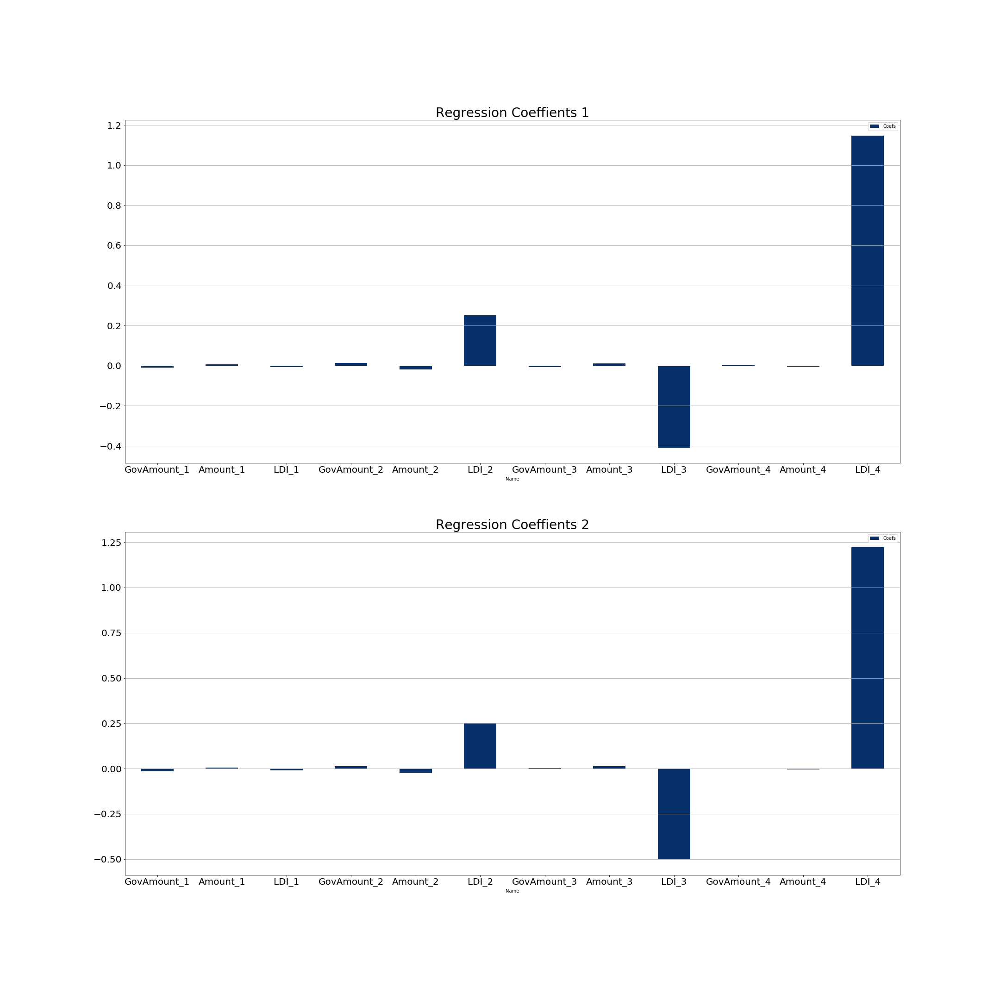

# LDI-index-prediction-model

### Description
*A simple yet suitable Linear Regression model is built to predict the Liberal Democracy Index of every country for the years 2020 and 2021.*

### Table of Contents
* 

### Aim
Build a time series regression model to predict the LDI index of every country in the years 2020 and 2021.

### Requirements 
* 1) Python 
* 2) Jupyter Notebook

### **Modules**
- sklearn
- seaborn
- matplotlib
- pandas 
- numpy

* **All of these are covered in Anaconda**
* If the import module is not install - it can be installed using `pip install [module_name]`

### Setup 

### Pictures
<li>
Regression Coefficients

<li/>
### Sources

